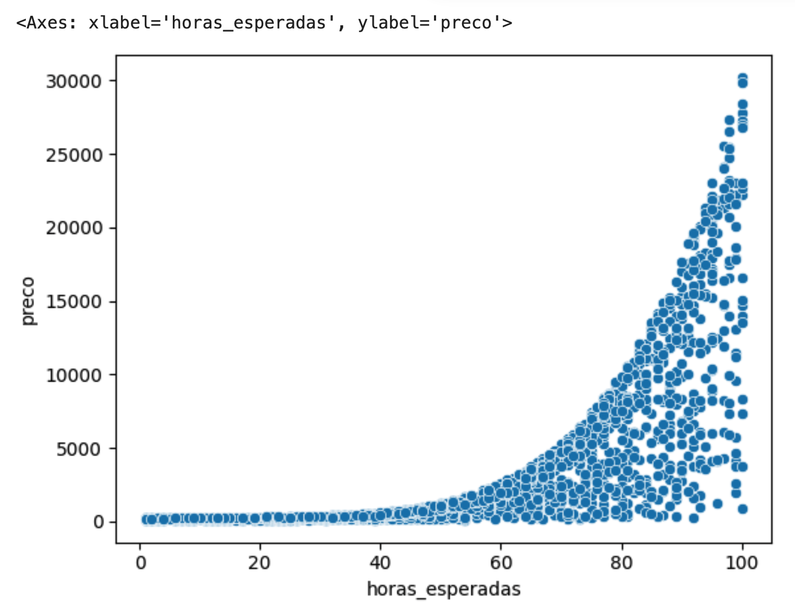

# Otimização na escolha do Algoritmo de Classificação
- Etapas
## Seleção de dados para treino e para testes
   
```python
import pandas as pd 
uri= 'https://gist.githubusercontent.com/guilhermesilveira/1b7d5475863c15f484ac495bd70975cf/raw/16aff7a0aee67e7c100a2a48b676a2d2d142f646/projects.csv'
dados = pd.read_csv(uri)
mapa_alteracao_titulos = {
    "expected_hours": "horas_esperadas",
    "price": "preco",
    "unfinished": "nao_finalizado"
}
dados = dados.rename(columns=mapa_alteracao_titulos)
troca = {
0: 1,
1: 0
}
dados["finalizado"] = dados.nao_finalizado.map(troca)
x = dados[["horas_esperadas", "preco"]]
y = dados["finalizado"]
```

## Avaliar os dados de treino e de teste
```python  
print(x.shape)
print(y.shape)
x.value_counts()
y.value_counts()
```

## Decisão de treinar com 75% dos dados e testar com 25% dos dados
```python
treino_x = x[:75]
treino_y = y[:75]
teste_x = x[75:]
teste_y = y[75:]
```  

## Treino
```python
from sklearn.svm import LinearSVC
modelo = LinearSVC()
modelo.fit(treino_x, treino_y)
```

## Teste e identificação da acurácia
```python
previsoes = modelo.predict(teste_x)
from sklearn.metrics import accuracy_score
acuracia = accuracy_score(teste_y, previsoes) * 100
print("A acurácia de %.2f%%" % acuracia)
```  

## Reteste, com split de sklearn, e reidentificação da acurácia
```python
from sklearn.model_selection import train_test_split
SEED = 20
treino_x, teste_x, treino_y, teste_y = train_test_split(x, y, random_state = SEED, test_size = 0.25)
# retreino
from sklearn.svm import LinearSVC
modelo = LinearSVC()
modelo.fit(treino_x, treino_y)
# reteste e identificação da acurácia
previsoes = modelo.predict(teste_x)
from sklearn.metrics import accuracy_score
acuracia = accuracy_score(teste_y, previsoes) * 100
print("A acurácia de %.2f%%" % acuracia)
```  

## Plotar e avaliar a dispersão dos dados.
```python
import seaborn as sns
sns.scatterplot(x="horas_esperadas", y="preco", data=dados)
```


## Avaliar graficamente a dispersão dos dados com cores para valores da coluna "finalizados"
```python
import seaborn as sns
sns.scatterplot(x="horas_esperadas", y="preco", hue="finalizados", data=dados)
```

## Avaliar graficamente a dispersão dos dados com gráficos separados para valores da coluna "finalizados" e com cores para a mesma coluna
```python
import seaborn as sns
sns.relplot(x="horas_esperadas", y="preco", col="finalizados", hue="finalizados",data=dados)
```
